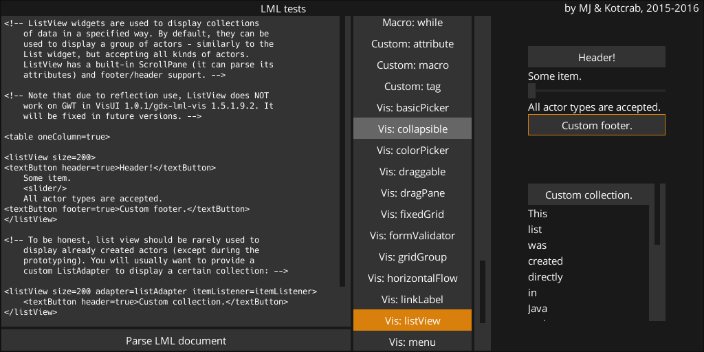
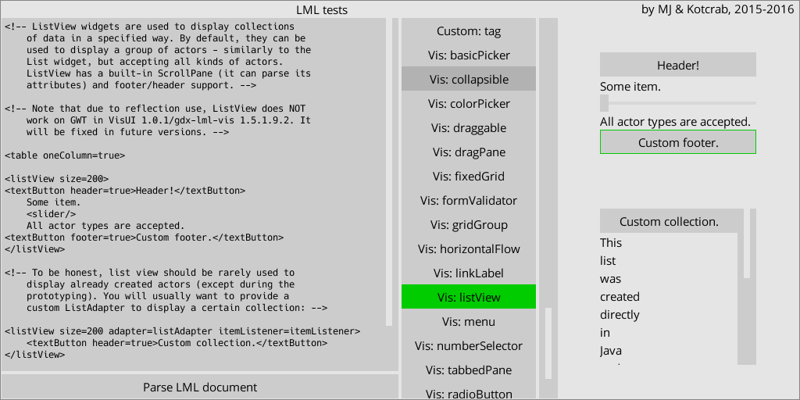

# *Tinted* VisUI skin

The default **VisUI** skin looks great, no doubt about that. But it was made with a specific goal in mind: an editor. Unless you're working on a tool yourself - or a science fiction themed game - it is unlikely to fit your needs unmodified. Still, the base itself isn't bad at all. If only you could color it *en masse*, without having to write some scripts or spend hours in image editors...

### Meet *Tinted*

The idea is simple: provide as many single color images and tint them at runtime. If impossible to create with 1 color, *make it possible* with transparent elements. Keep it compatible with official **VisUI**: you should be able to drop it into your previously customized skin and it should *just work* - as long as you have kept the image names untouched. Make it as customizable as possible.

And now the best part: it *can* be done without any dirty hacks in Java. `Skin` API already contains the `TintedDrawable`, which allows you to recolor your assets with little effort. Let's *over*use this mechanism, shall we?



#### Customize your skin!

**Tinted** consists of 11 basic colors, which are used to tint the basic drawables. To avoid collisions and clearly separate **Tinted** internals from **VisUI** skin, both new colors and images start with the `t-` prefix:
```
	t-white: {r: 1, g: 1, b: 1, a: 1},
	t-black: {r: 0, g: 0, b: 0, a: 1},
	t-highlight: {r: 0.85, g: 0.5, b: 0.05, a: 1},
	t-highlight-medium: {r: 0.7, g: 0.4, b: 0, a: 1},
	t-highlight-dark: {r: 0.6, g: 0.3, b: 0, a: 1},
	t-warn: {r: 1, g: 0, b: 0, a: 1},
	t-light: {r: 0.4, g: 0.4, b: 0.4, a: 1},
	t-medium: {r: 0.2, g: 0.2, b: 0.2, a: 1},
	t-medium-dark: {r: 0.15, g: 0.15, b: 0.15, a: 1},
	t-dark: {r: 0.1, g: 0.1, b: 0.1, a: 1},
	t-alpha: {r: 0, g: 0, b: 0, a: 0.5},
```

After changing values of these colors, your whole skin gets recolored *immediately* at runtime. This is pretty much as close to *CSS* as **LibGDX** gets. Even if you end up having to modify some assets by hand to achieve your final perfect look, the prototyping capabilities of such setup are obvious. Brief color descriptions:

- `t-white`: replaces default `white`; used as the default font color all over the place.
- `t-black`: replaces default `black`. Not used in the skin (yet), kept for completeness.
- `t-highlight`: replaces default `vis-blue`. This is the color used to highlight pressed and focused widgets.
- `t-highlight-medium`: this color should be slightly darker/lighter than the previous one.
- `t-highlight-dark`: this color should be slightly darker/lighter than the previous one. Used for text selection.
- `t-warn`: replaces default `vis-red`. This is the color used to highlight errors and warnings.
- `t-light`: replaces default `grey`. Commonly used for hovered widgets (`over` style) and disabled fonts.
- `t-medium`: the most common color of widgets. Default color for buttons, text fields, etc.
- `t-medium-dark`: mostly used for disabled widgets.
- `t-dark`: used for backgrounds.
- `t-alpha`: used as dialog background.

Considering it takes about 10 lines of JSON data to turn the theme upside down, I think this skin is worth a try.



As a proof of concept, **Tinted** comes shipped slightly darker and with orange as the highlight color instead of the default blue.

#### Further down the spiral...

If you scroll down to `TintedDrawable` section, you'll find a bunch of drawables like these:
```
	border: {name: t-border, color: t-highlight},
	border-circle: {name: t-border-circle, color: t-highlight},
	border-circle-error: {name: t-border-circle, color: t-warn},
	border-dark-blue: {name: t-border, color: t-highlight-dark},
```

If you ever looked through raw **VisUI** assets, you should recognize the drawable names - in fact, *every default drawable is available at runtime*. The rest of the skin file is nearly untouched: it still uses the same old drawable names, which are simply recreated at runtime.

You can easily edit *how* they are recreated, of course. `name` is the name of actual image in the atlas. `color` is a reference to the tinting color. This is pretty much everything you need to know - by tweaking the colors and drawable names in `TintedDrawable` section, you can modify any widget without breaking the default styles.

By copy-pasting the `Color` and `TintedDrawable` definitions into your previous **VisUI** skin, you can start using **Tinted** without sacrificing your custom styles.

#### Compatibility

The raw assets were taken from `1.3.0` **VisUI** version. Create an issue or pull request if anything is not working or missing.

#### Things to consider

- Raw images amount went **originally** from about 95 to **42**, 13 of which were simple icons and 2 were font sheets. As we all know, *42* is the meaning of life, so it has got to mean *something*.
- Some simple images (like check box tick, select box arrow, tree icons) were made simpler in `X1` for easier scaling. Except for the font and icons, the UI still looks very nice when scaled *x2, x3,* and so on. If you change your font to more a pixel-art-ish one, you can achieve a very pleasant retro feel.
- The only images with more than one color are the color chooser assets, which should be left untouched anyway - they are black and white, and I don't imagine anyone would like to change that in an actual application.
- `default` and `noborder` window styles were inverted: `noborder` *has* a border thanks to a transparent 1px rectangle. Although counter-intuitive, this was done (um) to *protect* you. The border does not look good with every setup, so you have to make a conscious decision to use it.
- Check boxes, radio buttons and select boxes achieve their double-color look thanks to transparency. When choosing the colors and designing your GUIs, keep in mind that these assets should be on a background with enough contrast. If desperate, edit their images manually and fill the transparent blanks.
- If you invert the scale by keeping `t-dark` color lighter and `t-light` darker, you'll create a theme with lighter backgrounds and darker widgets. As you probably know, some default desktop programs use such setups, usually with white(-ish) backgrounds and gray widgets.
- The default `white` and `grey` colors are usually used as font colors of regular and disabled widgets respectively. By changing these, you can modify how the text is displayed on the screen. By default, `white` is an alias of `t-white`, and `grey` - of `t-light`.
- Buttons, slider knobs and text fields now use shared drawable: `t-base`. Separate images for buttons, knobs and text fields were removed.
- As soon as you remove one of the fonts, your atlas (of `X1` skin) can be as small as 256x256px.
- `TextButton`, `Window` and other widgets extending `Table` could use `t-dot` (a single pixel) instead of `t-base` or `t-window` (nine patches) and apply paddings directly in Java. For example, setting button paddings to `4` with `t-dot` background would have pretty much the same effect as using `t-base`. I doubt that drawing GUI is worth such "optimizations", but keep in mind that it can be done. I should stop talking.

## License

Same as the **VisUI** library. As far as the author of this skin is concerned, you can do whatever the hell you want with these assets, as long as you don't use them to murder people. He would, however, like to see you try murdering people with images or JSON files.

The attached screenshots are from [`gdx-lml-vis-tests` project](https://github.com/czyzby/gdx-lml/tree/master/examples/gdx-lml-vis-tests) (note: with some paddings adjusted).

***[MJ 2016](https://github.com/czyzby/gdx-lml)***
